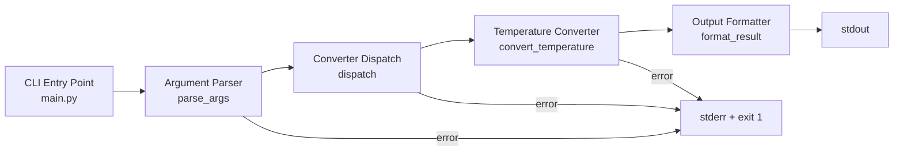

# Design Document: unit-converter-cli

## Overview

`unit-converter-cli` is a lightweight Python 3.12+ command-line tool with zero external dependencies, managed via `uv`. It accepts a conversion type, direction, and numeric value as positional arguments and prints the converted result to stdout, rounded to 2 decimal places. The first supported module is temperature conversion (Celsius ↔ Fahrenheit).

The tool is invoked as:

```
uv run main.py <conversion_type> <direction> <value>
```

Example:

```
uv run main.py temperature c2f 100
# Output: 212.00
```

All error messages go to stderr and the process exits with a non-zero code on any invalid input.

---

## Architecture

The design follows a simple three-layer pipeline:



- `main.py` is the single entry point; it owns argument parsing and top-level error handling.
- A **dispatch** function maps `(conversion_type, direction)` to the appropriate converter function.
- Each converter is a **pure function** — it takes a `float` and returns a `float`.
- A **formatter** rounds and formats the result to exactly 2 decimal places.

This keeps the conversion logic completely decoupled from I/O, making it straightforward to test.

---

## Components and Interfaces

### 1. CLI Entry Point (`main`)

```python
def main() -> None
```

- Reads `sys.argv[1:]`
- Validates argument count (must be exactly 3)
- Calls `dispatch(conversion_type, direction, value_str)`
- Prints formatted result to stdout
- Catches all `ValueError` / `KeyError` exceptions, prints to stderr, exits with code 1

### 2. Argument Parser (`parse_args`)

```python
def parse_args(args: list[str]) -> tuple[str, str, str]
```

- Returns `(conversion_type, direction, raw_value)` from the argument list
- Raises `ValueError` with a usage message if `len(args) != 3`

### 3. Converter Dispatch (`dispatch`)

```python
def dispatch(conversion_type: str, direction: str, raw_value: str) -> float
```

- Looks up `(conversion_type, direction)` in a registry dict
- Raises `ValueError` with a descriptive message for unknown type or direction
- Parses `raw_value` to `float`; raises `ValueError` with a descriptive message if not numeric
- Calls the matched converter function and returns the result

### 4. Temperature Converter

```python
def celsius_to_fahrenheit(value: float) -> float
def fahrenheit_to_celsius(value: float) -> float
```

Pure functions implementing the standard formulas:

- `c2f`: `(value × 9/5) + 32`
- `f2c`: `(value − 32) × 5/9`

### 5. Output Formatter (`format_result`)

```python
def format_result(value: float) -> str
```

- Returns `f"{value:.2f}"` — always 2 decimal places, including trailing zeros.

### 6. Converter Registry

```python
CONVERTERS: dict[tuple[str, str], Callable[[float], float]] = {
    ("temperature", "c2f"): celsius_to_fahrenheit,
    ("temperature", "f2c"): fahrenheit_to_celsius,
}
```

Adding a new conversion type requires only adding entries to this dict.

---

## Data Models

No persistent data models are needed. All data flows through the call stack as plain Python values:

| Stage | Type | Description |
|---|---|---|
| Raw CLI args | `list[str]` | `sys.argv[1:]` |
| Parsed args | `tuple[str, str, str]` | `(type, direction, raw_value)` |
| Input value | `float` | Parsed numeric input |
| Output value | `float` | Result from converter function |
| Formatted output | `str` | `f"{value:.2f}"` |

---

## Correctness Properties

*A property is a characteristic or behavior that should hold true across all valid executions of a system — essentially, a formal statement about what the system should do. Properties serve as the bridge between human-readable specifications and machine-verifiable correctness guarantees.*

### Property 1: Celsius–Fahrenheit round-trip

*For any* float value `v`, applying `celsius_to_fahrenheit` followed by `fahrenheit_to_celsius` SHALL return a value within floating-point tolerance of `v`.

**Validates: Requirements 1.1, 2.1**

### Property 2: Celsius-to-Fahrenheit formula correctness

*For any* float value `v`, `celsius_to_fahrenheit(v)` SHALL equal `(v * 9 / 5) + 32`.

**Validates: Requirements 1.1**

### Property 3: Output always has exactly 2 decimal places

*For any* float value `v`, `format_result(v)` SHALL return a string that matches the pattern `-?\d+\.\d{2}` — always exactly 2 digits after the decimal point, including trailing zeros.

**Validates: Requirements 1.2, 2.2, 3.1, 3.2**

### Property 4: Non-numeric input is always rejected

*For any* string that cannot be parsed as a float, `dispatch` SHALL raise a `ValueError` with a descriptive message.

**Validates: Requirements 1.3, 2.3**

### Property 5: Unknown conversion type or direction is always rejected

*For any* `(conversion_type, direction)` pair not present in the converter registry, `dispatch` SHALL raise a `ValueError` with a descriptive message listing the supported options.

**Validates: Requirements 4.1, 4.2**

---

## Error Handling

All errors are surfaced as `ValueError` exceptions raised from within the dispatch/converter layer. `main` catches them, writes the message to `sys.stderr`, and calls `sys.exit(1)`.

| Condition | Error message style | Exit code |
|---|---|---|
| Wrong number of CLI args | `Usage: uv run main.py <type> <direction> <value>` | 1 |
| Unknown conversion type | `Unknown conversion type '<x>'. Supported: temperature` | 1 |
| Unknown direction | `Unknown direction '<x>' for 'temperature'. Supported: c2f, f2c` | 1 |
| Non-numeric value | `Invalid value '<x>': must be a number` | 1 |

No exceptions are allowed to propagate to the top level unhandled.

---

## Testing Strategy

### Unit Tests (example-based)

- `test_celsius_to_fahrenheit`: spot-check known values (0°C → 32°F, 100°C → 212°F, -40°C → -40°F).
- `test_fahrenheit_to_celsius`: spot-check known values (32°F → 0°C, 212°F → 100°C, -40°F → -40°C).
- `test_format_result_trailing_zeros`: verify `format_result(100.0)` → `"100.00"`, `format_result(37.8)` → `"37.80"`.
- `test_dispatch_unknown_type`: assert `ValueError` for `dispatch("length", "m2ft", "1")`.
- `test_dispatch_unknown_direction`: assert `ValueError` for `dispatch("temperature", "x2y", "1")`.
- `test_dispatch_invalid_value`: assert `ValueError` for `dispatch("temperature", "c2f", "abc")`.
- `test_parse_args_insufficient`: assert `ValueError` for `parse_args([])`, `parse_args(["temperature"])`, `parse_args(["temperature", "c2f"])`.

### Property-Based Tests (using [Hypothesis](https://hypothesis.readthedocs.io/))

Property tests use `hypothesis` with `@given(st.floats(...))` and run a minimum of 100 iterations each.

> Note: `hypothesis` is a dev-only dependency and does not violate Requirement 5 (no runtime external dependencies).

| Property | Test tag |
|---|---|
| Property 1: Round-trip | `Feature: unit-converter-cli, Property 1: celsius-fahrenheit round-trip` |
| Property 2: c2f formula | `Feature: unit-converter-cli, Property 2: celsius-to-fahrenheit formula` |
| Property 3: 2 decimal places | `Feature: unit-converter-cli, Property 3: output 2 decimal places` |
| Property 4: Non-numeric rejected | `Feature: unit-converter-cli, Property 4: non-numeric input rejected` |
| Property 5: Unknown key rejected | `Feature: unit-converter-cli, Property 5: unknown dispatch key rejected` |

Each property test is tagged with a comment referencing the design property it validates.

### Smoke Tests

- Verify `pyproject.toml` has no runtime dependencies.
- Run `uv run main.py temperature c2f 0` and assert exit code 0 and output `32.00`.
